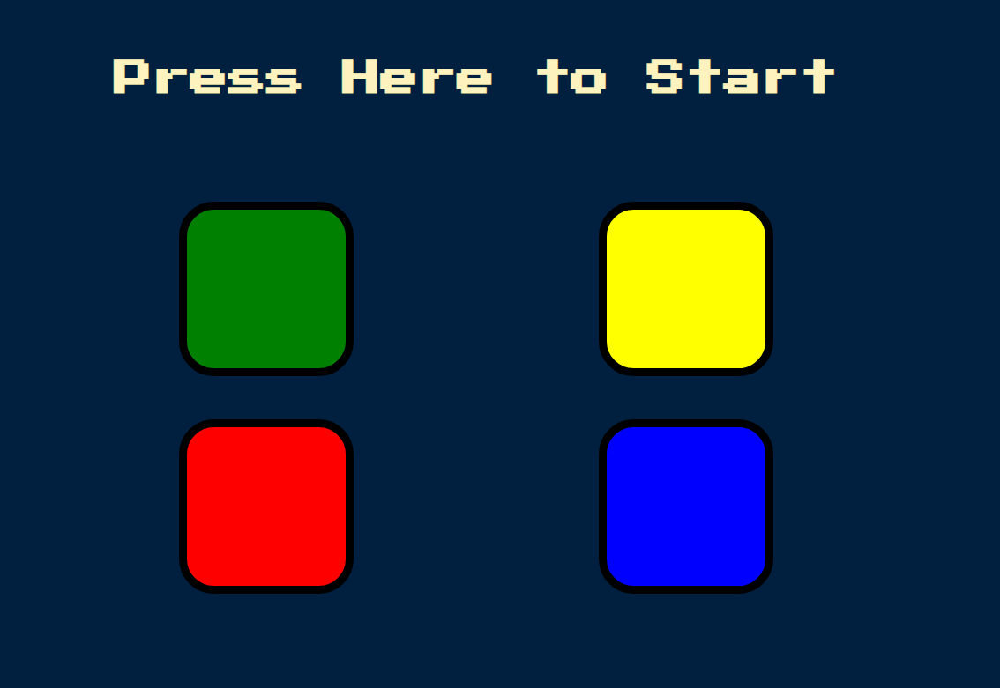

# Angela Yu Web Development Course - Simon Game Javascript Challenge solution

This is a solution to the [Simon Game Javascript exercise chapter by Angela Yu](https://www.udemy.com/course/the-complete-web-development-bootcamp). 

## Table of contents

- [Overview](#overview)
  - [The challenge](#the-challenge)
  - [Screenshot](#screenshot)
  - [Links](#links)
- [My process](#my-process)
  - [Built with](#built-with)
  - [What I learned](#what-i-learned)
  - [Continued development](#continued-development)
  - [Useful resources](#useful-resources)
- [Author](#author)

## Overview

### The challenge

Users should be able to:
- Click on the screen to start the game, 
- Press the colored buttons that will light up and play a sound in random sequence, adding one additional button, starting at one, into the sequence at random if they successfully press all the buttons in the correct order.
- Restart the game by clicking on the screen if the game is in the game over state.  
- View the optimal layout depending on their device's screen size

### Screenshot




### Links

- Solution URL: [https://github.com/wilso663/drum-kit-challenge](https://github.com/wilso663/simon-game-challenge)
- Live Site URL: [https://festive-ride-812509.netlify.app/](https://festive-ride-812509.netlify.app/)

## My process

### Built with

- CSS 3, jQuery
- Desktop-first workflow

### What I learned

The most helpful thing that I learned was using jQuery in place of adding click listeners individually to each button class.
```javascript
  $('[type="button"').click(function(){
  let userChosenColour = $(this).attr('id');
  userClickedPattern.push(userChosenColour);
  checkAnswer(userClickedPattern.length -1);
});
});
```
The basic callback for setTimeout was helpful in simulating a timed enable/disable functionality. It was also nice to not have to create the animation state change with timers in CSS.
```javascript  
  function checkAnswer(currentLevel){
  let answer = userClickedPattern[currentLevel];
  if(answer === gamePattern[currentLevel]){
    if(userClickedPattern.length === gamePattern.length){
        setTimeout(() => {
        nextSequence();
      }, 1000);
    }
  } else {
    $('body').addClass('game-over');
    setTimeout(() => {
      $('body').removeClass('game-over');
    }, 200);

  }
}
```


### Continued development

As this is a small project intended as an exercise, additional development is entirely up to adding new features. Since the mobile and desktop layouts look and function as intended, this release is intended to be final.

### Useful resources

- [jQuery Web Docs](https://api.jquery.com/addclass/) - The official documentation for jQuery development was helpful in referencing some functionality for adding and removing the game-over class which I used for the game over state.
- [StackOverflow](https://stackoverflow.com/questions/18121412/how-to-get-value-of-a-button-type-button-with-jquery) - StackOverflow was helping in finding syntax for specific jQuery options since the official jQuery documentation shows more generic cases that weren't what I was hoping to do.

## Author

- Website - [Stephen Wilson](https://github.com/wilso663)
- Frontend Mentor - [@wilso663](https://www.frontendmentor.io/profile/wilso663)


